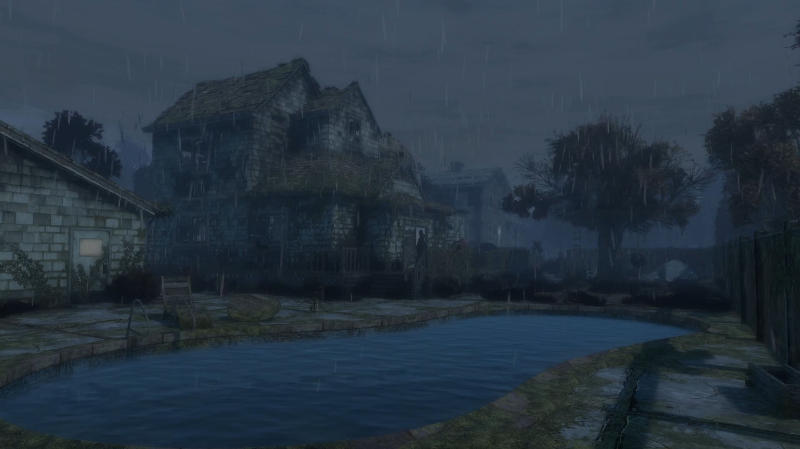
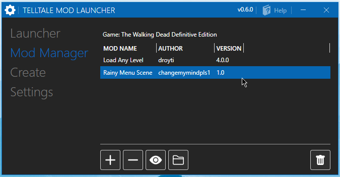

# Menu Rain for Telltale Definitive Series

### [Download the Mod here](https://github.com/changemymindpls/TTDS-MenuRain/releases)

### Install this mod using the [Telltale Mod Launcher](https://github.com/Telltale-Modding-Group/TelltaleModLauncher).

## DISCLAIMER

**This only works for 'The Walking Dead Telltale Definitive Edition'.**

## About

This simple mod adds rain to the menu scene for the The Walking Dead Telltale Definitive Edition, complete with full rain effects and sound!

**Built using the [Telltale Script Editor](https://github.com/Telltale-Modding-Group/Telltale-Script-Editor)**

## Download

**[Download the mod](https://github.com/changemymindpls/TTDS-MenuRain/releases)**

**This mod is compatible with the [Telltale Mod Launcher](https://github.com/Telltale-Modding-Group/TelltaleModLauncher) and can be installed using the tool.**

